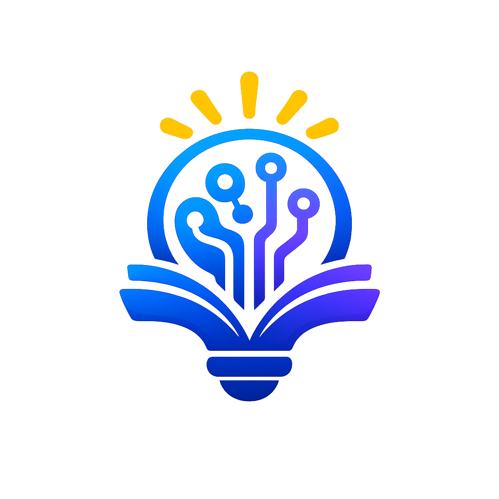
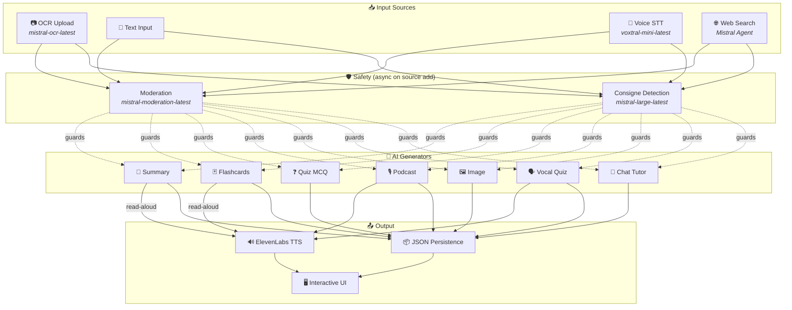
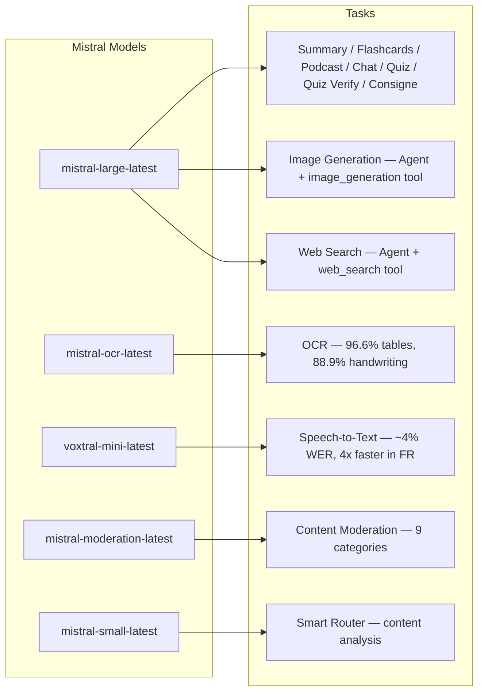
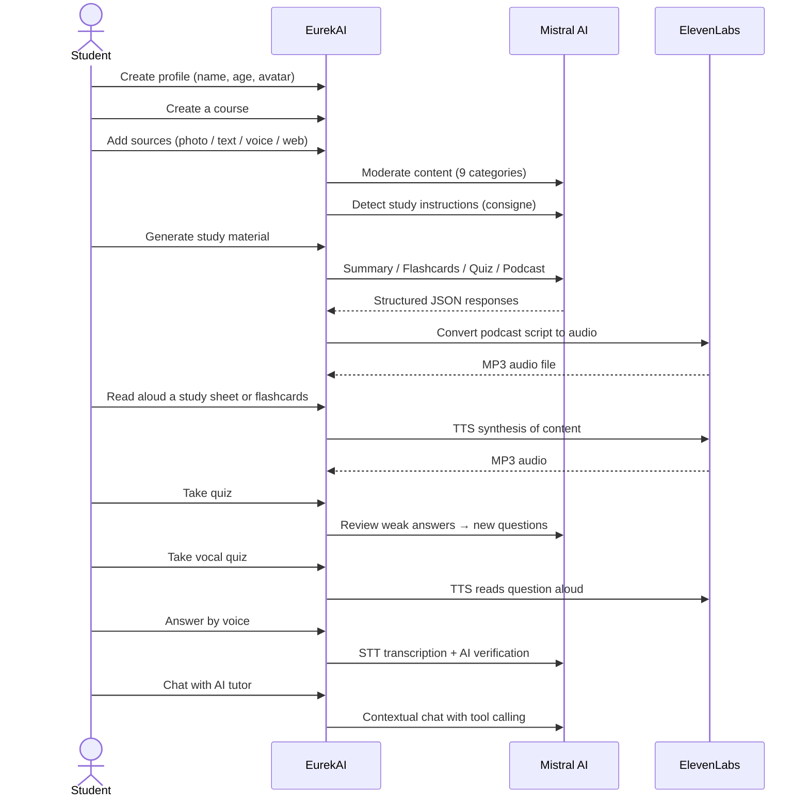

<p align="center">
  
</p>

<h1 align="center">EurekAI</h1>

<p align="center">
  <strong>Turn any learning material into an interactive study experience — powered by AI.</strong>
</p>

<p align="center">
  <a href="https://mistral.ai"></a>
  <a href="https://www.typescriptlang.org"></a>
  <a href="https://mistral.ai"></a>
  <a href="https://elevenlabs.io"></a>
</p>

<p align="center">
  <a href="https://www.youtube.com/watch?v=_b1TQz2leoI">▶️ Watch the demo on YouTube</a> · <a href="README.fr.md">🇫🇷 Lire en français</a>
</p>

---

## The Story — Why EurekAI?

**EurekAI** was born during the [Mistral AI Worldwide Hackathon](https://worldwidehackathon.mistral.ai/) (March 2026). I needed a project idea — and it came from something very real: I regularly help my daughter prepare for school tests, and I thought there had to be a way to make it more fun and interactive with AI.

The goal: take **any input** — a photo of a textbook, pasted text, a voice recording, a web search — and transform it into **study sheets, flashcards, quizzes, podcasts, illustrations, and more**. All powered by Mistral AI's French-native models, making it a naturally great fit for French-speaking students.

Every line of code was written during the hackathon. All APIs and open-source libraries are used in compliance with the hackathon rules.

---

## Features

| | Feature | Description |
|---|---|---|
| 📷 | **OCR Upload** | Snap a photo of your textbook or notes — Mistral OCR extracts the content |
| 📝 | **Text Input** | Type or paste any text directly |
| 🎤 | **Voice Input** | Record yourself speaking — Voxtral STT transcribes it |
| 🌐 | **Web Search** | Ask a question — a Mistral Agent searches the web for answers |
| 📄 | **Study Sheets** | Complete, structured revision notes with key points, vocabulary, citations, fun facts |
| 🃏 | **Flashcards** | 5 Q&A cards with source references for active recall |
| ❓ | **Quiz MCQ** | 10-20 multiple choice questions with adaptive review on mistakes |
| 🎙️ | **Podcast** | A 2-voice mini-podcast (Alex & Zoe) converted to audio via ElevenLabs |
| 🖼️ | **Illustrations** | AI-generated educational images via Mistral Agent |
| 🗣️ | **Vocal Quiz** | Questions read aloud, answer by voice, AI verifies your response |
| 💬 | **AI Chat Tutor** | Contextual chat with your course documents, with tool calling |
| 🧠 | **Smart Router** | AI analyzes your content and recommends the best generators |
| 🔒 | **Parental Controls** | Age-based moderation, parental PIN, chat restrictions |
| 🌍 | **Multilingual** | Full UI and AI content in French and English |
| 🔊 | **Read Aloud** | Listen to study sheets and flashcards read aloud via ElevenLabs TTS |

---

## Architecture Overview



---

## Model Usage Map



---

## User Journey



---

## Deep Dive — Features

### Multi-Modal Input

EurekAI accepts 4 types of input sources, all moderated before processing:

- **OCR Upload** — JPG, PNG, or PDF files processed by `mistral-ocr-latest`. Handles printed text, tables (96.6% accuracy), and handwriting (88.9% accuracy).
- **Free Text** — Type or paste any content. Runs through moderation before storage.
- **Voice Input** — Record audio in-browser. Transcribed by `voxtral-mini-latest` with ~4% WER. Setting `language="fr"` makes it 4x faster.
- **Web Search** — Enter a query. A temporary Mistral Agent with `web_search` tool retrieves and summarizes web results.

### AI Content Generation

Six types of generated learning material:

| Generator | Model | Output |
|---|---|---|
| **Study Sheet** | `mistral-large-latest` | Title, summary, 10-25 key points, vocabulary, citations, fun fact |
| **Flashcards** | `mistral-large-latest` | 5 Q&A cards with source references |
| **Quiz MCQ** | `mistral-large-latest` | 10-20 questions, 4 choices each, explanations, adaptive review |
| **Podcast** | `mistral-large-latest` + ElevenLabs | 2-voice script (Alex & Zoe) → MP3 audio |
| **Illustration** | `mistral-large-latest` Agent | Educational image via `image_generation` tool |
| **Vocal Quiz** | `mistral-large-latest` + ElevenLabs + Voxtral | TTS questions → STT answer → AI verification |

### AI Chat Tutor

A conversational tutor with full access to course documents:

- Uses `mistral-large-latest` with 30K character context window
- **Tool calling**: can generate summaries, flashcards, or quizzes inline during conversation
- 50-message history per course
- Content moderation for age-appropriate profiles

### Smart Auto-Router

The router uses `mistral-small-latest` to analyze source content and recommend which generators are most relevant — so students don't have to choose manually.

### Adaptive Learning

- **Quiz stats**: tracks attempts and per-question accuracy
- **Quiz review**: generates 5-10 new questions targeting weak concepts
- **Consigne detection**: detects study instructions ("I know my lesson if I can...") and prioritizes them across all generators

### Safety & Parental Controls

- **4 age groups**: enfant (6-10), ado (11-15), etudiant (16+), adulte
- **Content moderation**: 9 categories via `mistral-moderation-latest`, thresholds adapted per age group
- **Parental PIN**: SHA-256 hashed, required for profiles under 15
- **Chat restrictions**: AI chat only available for profiles aged 15+

### Multi-Profile System

- Multiple profiles with name, age, avatar, locale preferences
- Projects are linked to profiles via `profileId`
- Cascade delete: removing a profile removes all its projects

### Internationalization

- Full UI available in French and English
- AI prompts support 2 languages today (FR, EN) with architecture ready for 15 (es, de, it, pt, nl, ja, zh, ko, ar, hi, pl, ro, sv)
- Language is set per profile

---

## Tech Stack

| Layer | Technology | Role |
|---|---|---|
| **Runtime** | Node.js + TypeScript 5.7 | Server and type safety |
| **Backend** | Express 4.21 | REST API |
| **Dev Server** | Vite 7.3 + tsx | HMR, Handlebars partials, proxy |
| **Frontend** | HTML + TailwindCSS 4.2 + Alpine.js 3.15 | Reactive UI, TypeScript compiled by Vite |
| **Templating** | vite-plugin-handlebars | Partial-based HTML composition |
| **AI** | Mistral AI SDK 1.14 | Chat, OCR, STT, Agents, Moderation |
| **TTS** | ElevenLabs SDK 2.36 | Text-to-speech for podcasts and vocal quizzes |
| **Icons** | Lucide 0.575 | SVG icon library |
| **Markdown** | Marked 17 | Rendering markdown in chat |
| **File Upload** | Multer 1.4 | Multipart form handling |
| **Audio** | ffmpeg-static | Audio processing |
| **Testing** | Vitest 4 | Unit tests |
| **Persistence** | JSON files | Zero-dependency data storage |

---

## Model Reference

| Model | Usage | Why |
|---|---|---|
| `mistral-large-latest` | Summary, Flashcards, Podcast, Quiz MCQ, Chat, Quiz Verify, Image Agent, Web Search Agent, Consigne Detection | Best multilingual + instruction following |
| `mistral-ocr-latest` | Document OCR | 96.6% table accuracy, 88.9% handwriting |
| `voxtral-mini-latest` | Speech-to-Text | ~4% WER, `language="fr"` gives 4x+ speed |
| `mistral-moderation-latest` | Content moderation | 9 categories, child safety |
| `mistral-small-latest` | Smart Router | Fast content analysis for routing decisions |
| `eleven_v3` (ElevenLabs) | Text-to-Speech | Natural French voices for podcasts and vocal quizzes |

---

## Quick Start

```bash
# Clone the repository
git clone https://github.com/your-username/eurekai.git
cd eurekai

# Install dependencies
npm install

# Configure API keys
cp .env.example .env
# Edit .env with your keys:
#   MISTRAL_API_KEY=your_key_here
#   ELEVENLABS_API_KEY=your_key_here  (optional, for audio features)

# Start development
npm run dev
# → Backend:  http://localhost:3000 (API)
# → Frontend: http://localhost:5173 (Vite dev server with HMR)
```

> **Note**: ElevenLabs is optional. Without it, podcast and vocal quiz features will generate scripts but skip audio synthesis.

---

## Project Structure

```
server.ts                 — Express entry point, mounts routes + config
config.ts                 — Runtime config (models, voices, TTS), persisted in output/config.json
store.ts                  — ProjectStore: CRUD projects/sources/generations, JSON persistence
profiles.ts               — ProfileStore: profile management, PIN hashing
types.ts                  — TypeScript types: Source, Generation (6 types), QuizStats, Profile
prompts.ts                — All AI prompts centralized (system + user templates, FR/EN)

generators/
  ocr.ts                  — Upload + OCR via Mistral (JPG, PNG, PDF)
  summary.ts              — Study sheet generation (structured JSON)
  flashcards.ts           — 5 Q&A flashcards
  quiz.ts                 — Quiz MCQ (10-20 questions) + adaptive review
  podcast.ts              — 2-voice podcast script (Alex + Zoe)
  quiz-vocal.ts           — Vocal quiz: TTS questions + STT answers + AI verification
  image.ts                — Image generation via Mistral Agent (image_generation tool)
  chat.ts                 — AI chat tutor with tool calling
  router.ts               — Smart auto-router (content → recommended generators)
  consigne.ts             — Study instruction detection
  tts.ts                  — ElevenLabs TTS (eleven_v3, segment concatenation)
  stt.ts                  — Voxtral STT (audio → text)
  websearch.ts            — Mistral Agent with web_search tool
  moderation.ts           — Content moderation (9 categories)

routes/
  projects.ts             — CRUD projects
  sources.ts              — Upload OCR, free text, voice STT, web search, moderation
  generate.ts             — Generation endpoints (summary/flashcards/quiz/podcast/image/vocal)
  generations.ts          — Quiz attempts, vocal answers, read-aloud, rename, delete
  chat.ts                 — AI chat with tool calling
  profiles.ts             — Profile CRUD with PIN management

helpers/
  index.ts                — safeParseJson, unwrapJsonArray, extractAllText, timer
  audio.ts                — collectStream (ReadableStream → Buffer)

src/                      — Frontend (Vite + Handlebars)
  index.html              — Main HTML entry point
  main.ts                 — Frontend entry (Alpine.js init + Lucide icons)
  app/                    — Alpine.js application modules
    state.ts              — Reactive state management
    navigation.ts         — View routing + age-based guards
    profiles.ts           — Profile picker logic
    projects.ts           — Course CRUD
    sources.ts            — Source upload handlers
    generate.ts           — Generation triggers
    generations.ts        — Generation display + actions
    chat.ts               — Chat interface
    render.ts             — HTML rendering helpers
    i18n.ts               — Language switching
    ...
  components/
    quiz.ts               — Interactive quiz component
    quiz-vocal.ts         — Vocal quiz component
  i18n/
    fr.ts                 — French translations
    en.ts                 — English translations
    index.ts              — i18n loader
  partials/               — Handlebars HTML partials (header, sidebar, dialogs, views)
  styles/
    main.css              — TailwindCSS entry
    theme.css             — Custom theme variables

public/assets/            — Static assets (logo, avatars)
output/                   — Runtime data (projects, config, audio files)
```

---

## API Reference

### Config
| Method | Endpoint | Description |
|---|---|---|
| `GET` | `/api/config` | Current configuration |
| `PUT` | `/api/config` | Update config (models, voices, TTS) |
| `GET` | `/api/config/status` | API status (Mistral, ElevenLabs) |

### Profiles
| Method | Endpoint | Description |
|---|---|---|
| `GET` | `/api/profiles` | List all profiles |
| `POST` | `/api/profiles` | Create profile |
| `PUT` | `/api/profiles/:id` | Update profile (PIN required for < 15) |
| `DELETE` | `/api/profiles/:id` | Delete profile + cascade projects |

### Projects
| Method | Endpoint | Description |
|---|---|---|
| `GET` | `/api/projects` | List projects |
| `POST` | `/api/projects` | Create project `{name, profileId}` |
| `GET` | `/api/projects/:pid` | Project details |
| `PUT` | `/api/projects/:pid` | Rename `{name}` |
| `DELETE` | `/api/projects/:pid` | Delete project |

### Sources
| Method | Endpoint | Description |
|---|---|---|
| `POST` | `/api/projects/:pid/sources/upload` | OCR upload (multipart files) |
| `POST` | `/api/projects/:pid/sources/text` | Free text `{text}` |
| `POST` | `/api/projects/:pid/sources/voice` | Voice STT (multipart audio) |
| `POST` | `/api/projects/:pid/sources/websearch` | Web search `{query}` |
| `DELETE` | `/api/projects/:pid/sources/:sid` | Delete source |
| `POST` | `/api/projects/:pid/moderate` | Moderate `{text}` |
| `POST` | `/api/projects/:pid/detect-consigne` | Detect study instructions |

### Generation
| Method | Endpoint | Description |
|---|---|---|
| `POST` | `/api/projects/:pid/generate/summary` | Study sheet `{sourceIds?}` |
| `POST` | `/api/projects/:pid/generate/flashcards` | Flashcards `{sourceIds?}` |
| `POST` | `/api/projects/:pid/generate/quiz` | Quiz MCQ `{sourceIds?}` |
| `POST` | `/api/projects/:pid/generate/podcast` | Podcast `{sourceIds?}` |
| `POST` | `/api/projects/:pid/generate/image` | Illustration `{sourceIds?}` |
| `POST` | `/api/projects/:pid/generate/quiz-vocal` | Vocal quiz `{sourceIds?}` |
| `POST` | `/api/projects/:pid/generate/quiz-review` | Adaptive review `{generationId, weakQuestions}` |
| `POST` | `/api/projects/:pid/generate/auto` | Smart router auto-generation |

### Generations CRUD
| Method | Endpoint | Description |
|---|---|---|
| `POST` | `/api/projects/:pid/generations/:gid/quiz-attempt` | Submit quiz answers `{answers}` |
| `POST` | `/api/projects/:pid/generations/:gid/vocal-answer` | Verify spoken answer (multipart audio + questionIndex) |
| `POST` | `/api/projects/:pid/generations/:gid/read-aloud` | TTS read-aloud for summaries/flashcards |
| `PUT` | `/api/projects/:pid/generations/:gid` | Rename `{title}` |
| `DELETE` | `/api/projects/:pid/generations/:gid` | Delete generation |

### Chat
| Method | Endpoint | Description |
|---|---|---|
| `GET` | `/api/projects/:pid/chat` | Get chat history |
| `POST` | `/api/projects/:pid/chat` | Send message `{message}` |
| `DELETE` | `/api/projects/:pid/chat` | Clear chat history |

---

## Architecture Decisions

| Decision | Rationale |
|---|---|
| **Alpine.js over React/Vue** | Minimal footprint, lightweight reactivity with Vite-compiled TypeScript. Perfect for a hackathon where speed matters. |
| **JSON file persistence** | Zero dependency, instant setup. No database to configure — just start and go. |
| **Vite + Handlebars** | Best of both worlds: fast HMR for development, HTML partials for code organization, Tailwind JIT. |
| **Centralized prompts** | All AI prompts in `prompts.ts` — easy to iterate, test, and adapt per language/age group. |
| **Multi-generation system** | Each generation is an independent object with its own ID — allows multiple summaries, quizzes, etc. per course. |
| **Age-adapted prompts** | 4 age groups with different vocabulary, complexity, and tone — the same content teaches differently based on the learner. |
| **Agent-based features** | Image generation and web search use temporary Mistral Agents — clean lifecycle with automatic cleanup. |

---

## Credits & Acknowledgments

- **[Mistral AI](https://mistral.ai)** — AI models (Large, OCR, Voxtral, Moderation, Small) + Worldwide Hackathon
- **[ElevenLabs](https://elevenlabs.io)** — Text-to-Speech engine (`eleven_v3`)
- **[Alpine.js](https://alpinejs.dev)** — Lightweight reactive framework
- **[TailwindCSS](https://tailwindcss.com)** — Utility-first CSS framework
- **[Vite](https://vitejs.dev)** — Frontend build tool
- **[Lucide](https://lucide.dev)** — Icon library
- **[Marked](https://marked.js.org)** — Markdown parser

Built with care during the Mistral AI Worldwide Hackathon, March 2026.

---

## Author

**Julien LS** — [contact@jls42.org](mailto:contact@jls42.org)

## License

[AGPL-3.0](LICENSE) — Copyright (C) 2026 Julien LS
